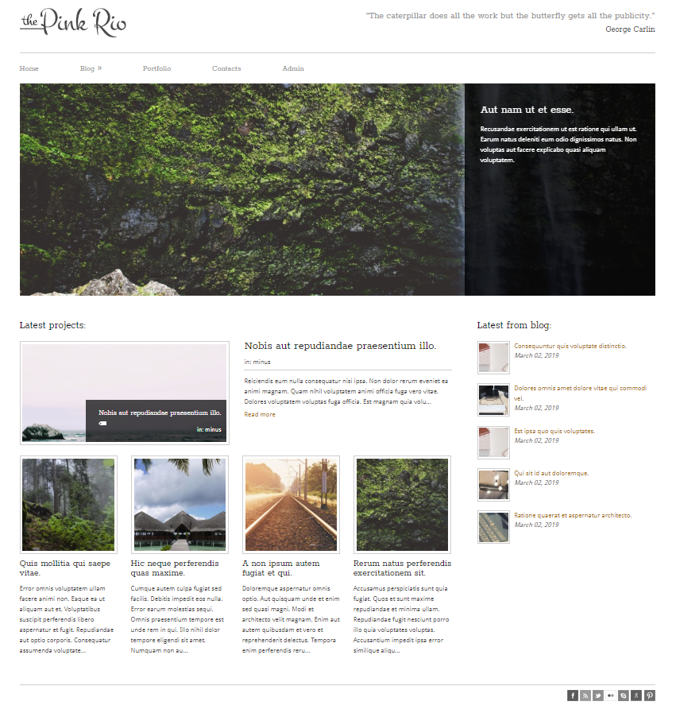
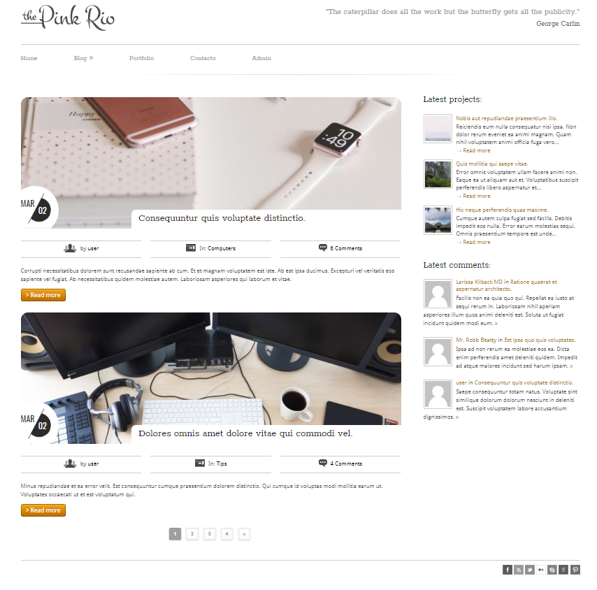
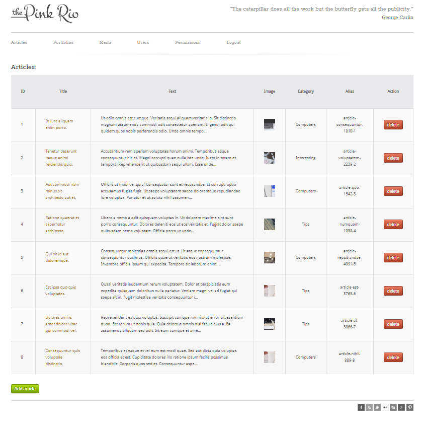

# corporate.loc
 Laravel 5.7
 <b>Задача:</b>
 Сделать сайт на laravel в рамках учебного курса. 
 Исправить структуру кода (добавить services, переработать контроллеры, модели, репозитории)

 <b>Установка:</b>
 composer install
 Подправить .env с доступом к БД
 php artisan key:generate
 php artisan migrate --seed

 <b>Для входа в админ панель нужно использовать:</b>
 <b>login:</b>
 user
 <b>password:</b>
 123456 

 <b>Особенности проекта:</b>
1. Для создания и заполнения базы данных использовались миграции и Laravel seeder.
2. Реализована основная функциональность сайта (страницы со статьями, портфолио, возможность комментировать статьи)
 Главная страница:
 
 Страница со статьями:
 
3. Реализована админ панель сайта:
 - добавление/удаление/редактирование статьей и портфолио;
 - возможность добавлять новых пользователей;
 - менять роли и привилегии пользователей;
 Панель администратора:
 
